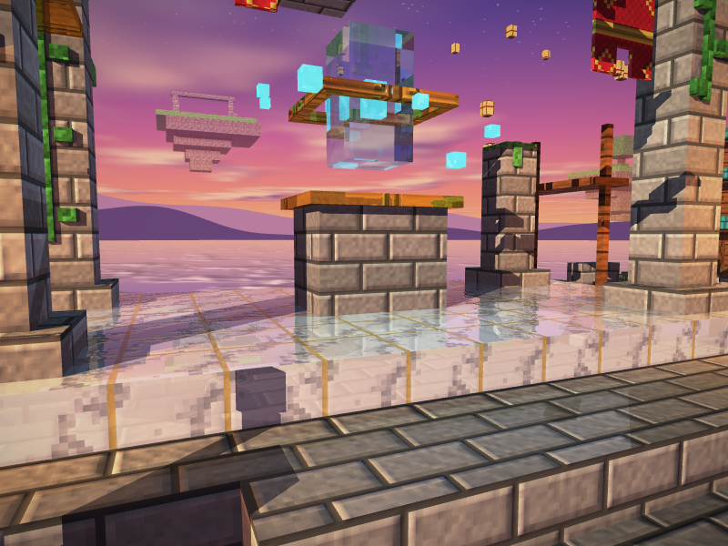
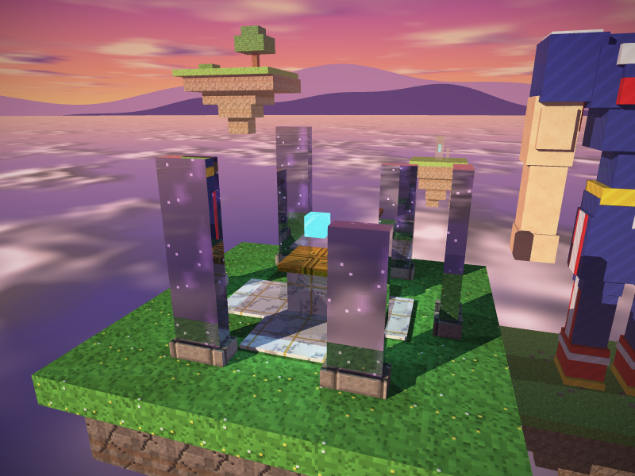
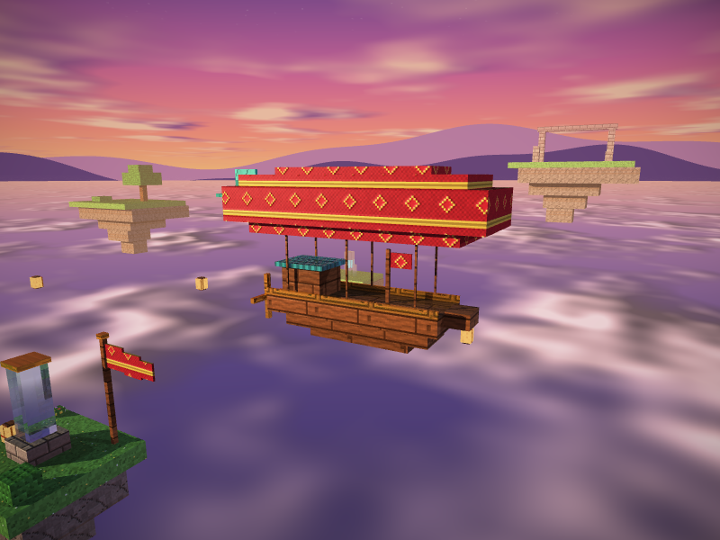
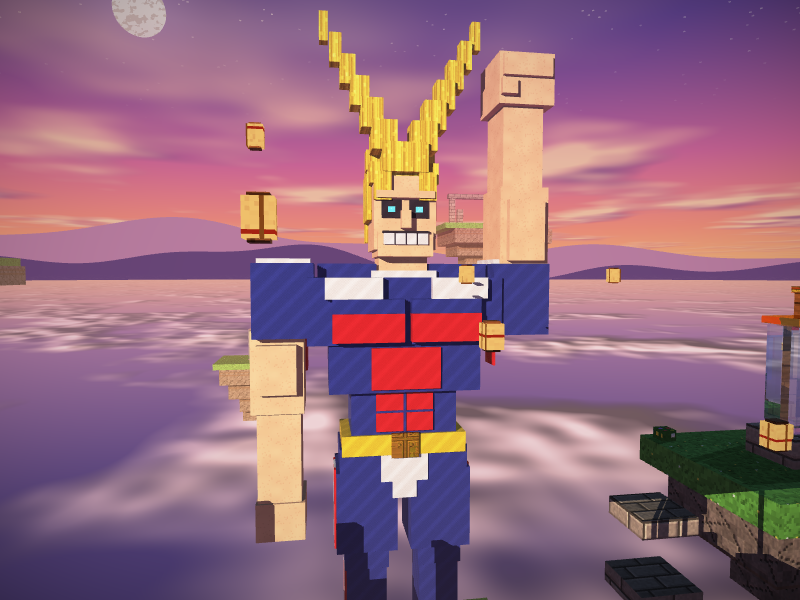
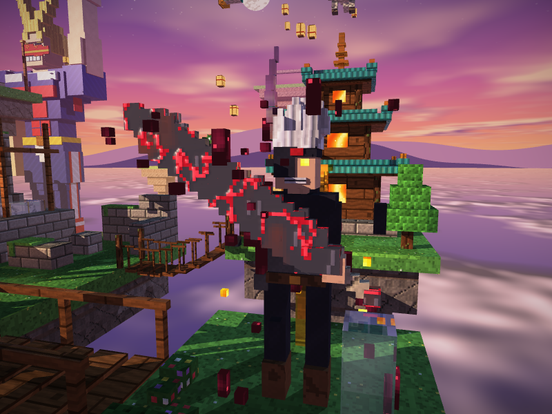

# Proyecto 2 - Raytracing: Santuario flotante

Este proyecto es un diorama hecho con cubos y renderizado con raytracing en
Rust. La escena es un santuario en ruinas sobre varias islas flotantes. También
incluye una pagoda, un cerezo, dragones, un dirigible, All Might y Asta.

El render se calcula en el CPU. La escena tiene 1447 cajas, 35 materiales y
10 luces.


## Video

**Video de demostración:** [Ver en YouTube](https://www.youtube.com/watch?v=EvghV7k645k)

## Cómo ejecutarlo

Se necesita Rust (edición 2024), CMake y un compilador de C para compilar
raylib.

```bash
cargo run
```

El perfil `dev` usa `opt-level = 3`, por lo que no hace falta ejecutar el
proyecto con `--release`.

También hay dos modos que no abren la ventana:

```bash
# Guardar una captura: archivo, yaw, pitch, distancia y punto de la cámara opcional
cargo run -- --screenshot captura.png 0.6 0.35 22 1.5 1.0 -1.5

# Medir el tiempo de render de las vistas predefinidas
cargo run -- --bench
```

### Controles

| Tecla | Acción |
|---|---|
| `A` / `D`, flechas o arrastrar con el mouse | Rotar el diorama |
| `W` / `S` | Inclinar la cámara |
| `Q` / `E` o rueda del mouse | Acercar o alejar la cámara |
| `1` - `9` | Cambiar entre vistas predefinidas |
| `R` | Reiniciar la cámara |
| `Espacio` | Activar o detener el giro automático |
| `P` | Activar o desactivar la vista previa a media resolución |
| `F11` | Pantalla completa sin deformar la imagen |
| `F12` | Guardar una captura en `screenshots/` |
| `H` | Mostrar u ocultar la ayuda |

## Cumplimiento de la rúbrica

| Criterio | Cómo se cumple |
|---|---|
| Complejidad de la escena (30 puntos) | El diorama tiene 1447 cajas. Incluye el templo, pagoda, cerezo, estanque con peces, puentes, tres dragones, dirigible, islas lejanas, All Might y Asta. |
| Atractivo visual (20 puntos) | Se usó un atardecer, luces cálidas y frías, fuego, magia, farolillos, bruma, texturas con relieve y antialiasing. |
| Rotación y zoom (20 puntos) | La cámara puede rotar, inclinarse, acercarse y alejarse con teclado o mouse. También tiene nueve vistas guardadas. |
| Cinco materiales (25 puntos) | Piedra, madera, metal, cristal y agua. Cada uno tiene textura y parámetros propios de albedo, brillo especular, transparencia y reflectividad. |
| Refracción (10 puntos) | Se puede ver en el cristal del altar, el obelisco y el agua del estanque. |
| Reflexión (5 puntos) | Se usa en el metal, el mármol, la obsidiana, las tejas, el agua y el cristal. |
| Skybox (20 puntos) | El fondo tiene un cielo de atardecer con sol, luna, nubes, montañas y estrellas. |

## Materiales principales

Las texturas son procedurales, miden 32 x 32 píxeles y se generan desde
`procedural.rs`. Estos son los cinco materiales principales que pide la
rúbrica:

| Material | Albedo (RGB) | Specular | Shininess | Reflexión | Transparencia | IOR |
|---|---:|---:|---:|---:|---:|---:|
| Piedra | 255, 248, 235 | 0.10 | 8 | 0.02 | 0.00 | 1.00 |
| Madera | 255, 230, 205 | 0.25 | 16 | 0.05 | 0.00 | 1.00 |
| Metal | 255, 235, 190 | 0.90 | 128 | 0.65 | 0.00 | 1.00 |
| Cristal | 225, 245, 255 | 1.00 | 256 | 0.10 | 0.85 | 1.50 |
| Agua | 195, 230, 255 | 0.70 | 64 | 0.25 | 0.60 | 1.33 |

Además se agregaron materiales decorativos para el pasto, flores, corteza,
tejas, dragones, fuego, magia, mármol, obsidiana, papel, caminos, peces y los
dos personajes.

## Galería

| | |
|---|---|
|  **Altar y cristal:** refracción en el cristal y reflejo en el metal. |  **Estanque:** el agua refleja el cielo y refracta el fondo. |
|  **Contraluz:** el sol queda detrás del templo. |  **Obelisco:** cristal sobre la isla principal. |
|  **Braseros:** fuego y luz cálida. |  **Farol:** ilumina una de las islas. |
|  **Desde abajo:** parte inferior de las islas. |  **Dragón:** escamas, alas transparentes y ojos de fuego. |
|  **Pagoda:** tejas, ventanas encendidas y puente. |  **Cerezo:** árbol y pétalos alrededor. |
|  **Cristales:** materiales transparentes y magia. |  **Linternas:** luces junto al portal. |
|  **Mármol:** piso con reflejos. |  **Monolitos:** obsidiana reflectante. |
|  **Dirigible:** madera, tela y metal. |  **All Might:** personaje construido con cubos. |
|  **Asta:** espada, aura roja y antimagia. | |

## Detalles de implementación

Por cada píxel se lanza un rayo desde la cámara. Cuando el rayo toca una caja,
se calcula el color usando la textura, el albedo, las luces y las sombras.

- **Reflexión:** lanza otro rayo en la dirección reflejada. Se usa en metales,
  mármol, obsidiana, agua y cristal.
- **Refracción:** usa la ley de Snell para desviar el rayo cuando atraviesa
  cristal o agua.
- **Skybox:** si el rayo no toca ninguna caja, se dibuja el cielo procedural.
- **Texturas:** cada material tiene una textura y parámetros propios.
- **Sombras:** se lanza un rayo hacia cada luz para comprobar si hay un objeto
  en medio.
- **Relieve:** algunas texturas modifican la normal para que la superficie no
  se vea completamente plana.
- **Antialiasing:** cuando la cámara está quieta se promedian cuatro rayos por
  píxel.
- **Rendimiento:** el render trabaja en paralelo y usa un BVH para evitar
  revisar todas las cajas en cada rayo.

Los rayos de reflexión y refracción tienen un máximo de cuatro rebotes.

## Estructura del proyecto

| Archivo | Contenido |
|---|---|
| `main.rs` | Ventana, controles y modos de captura y benchmark |
| `camera.rs` | Cámara orbital |
| `renderer.rs` | Raytracing, iluminación, sombras, reflexión y refracción |
| `postprocess.rs` | Ajuste final de color y viñeta |
| `scene.rs` | Construcción de la escena y luces |
| `bvh.rs` | Aceleración de las intersecciones |
| `cube.rs` | Intersección de rayos con las cajas |
| `material.rs` | Datos de los materiales |
| `procedural.rs` | Generación de texturas |
| `skybox.rs` | Cielo procedural |
| `dragon.rs` | Modelo de los dragones |
| `characters.rs` | Modelos de All Might y Asta |

## Dependencias

Se usan solamente las dependencias permitidas para el proyecto:

- [`nalgebra-glm`](https://crates.io/crates/nalgebra-glm) 0.21.0 para los vectores.
- [`raylib`](https://crates.io/crates/raylib) 6.0.0 para la ventana, la entrada y
  las imágenes.

Las texturas, el ruido, el raytracing y el paralelismo están implementados en
el proyecto.
