# Proyecto 2 — Raytracing: Santuario flotante

Raytracer en Rust que renderiza en tiempo real un diorama voxel: un santuario
en ruinas sobre una isla flotante, al atardecer, sobre un mar de nubes, con
una pagoda en una isla vecina, un cerezo en flor y tres dragones volando
alrededor. Todo se calcula en el CPU, sin GPU ni shaders: 836 cajas, 17
materiales y 8 luces.

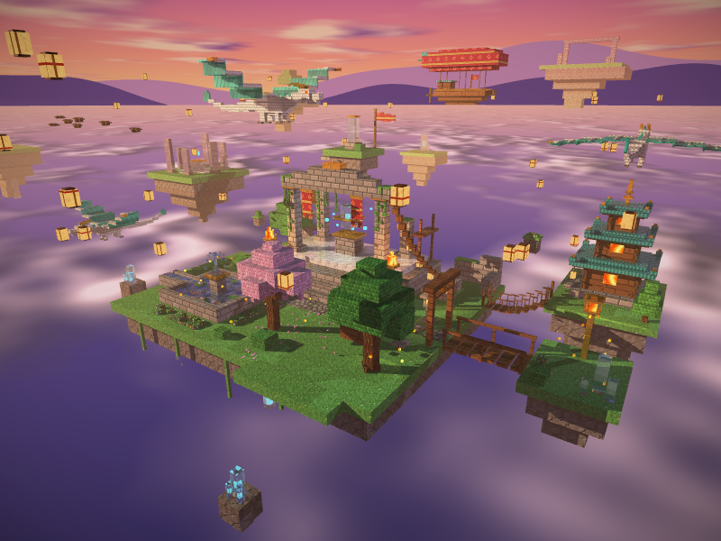

## Video

**Video de demostración:** _(pendiente: agregar el enlace)_

## Cómo ejecutarlo

Requiere Rust (edición 2024) y las herramientas de compilación de raylib
(CMake y un compilador de C).

```bash
cargo run
```

El perfil `dev` ya compila con `opt-level = 3`, así que `cargo run` corre a
velocidad completa. Al iniciar se imprime la tabla de materiales y el número
de cajas de la escena.

Modos sin ventana:

```bash
# Captura de un cuadro: archivo, yaw, pitch, distancia y (opcional) el punto que mira la cámara
cargo run -- --screenshot captura.png 0.6 0.35 22 1.5 1.0 -1.5

# Benchmark: renderiza cada vista predefinida 10 veces e imprime el promedio
cargo run -- --bench
```

### Controles

| Tecla | Acción |
|---|---|
| `A` / `D`, flechas o arrastrar con el mouse | Rotar alrededor del diorama |
| `W` / `S` | Inclinar la cámara |
| `Q` / `E` o rueda del mouse | Zoom |
| `1` – `6` | Vistas predefinidas (transición suave) |
| `R` | Reiniciar la cámara |
| `Espacio` | Giro automático |
| `P` | Activa o desactiva la vista previa a media resolución mientras la cámara se mueve (desactivada, todo se renderiza a resolución completa: útil para grabar) |
| `F12` | Guardar captura en `screenshots/` |
| `H` | Mostrar u ocultar la ayuda |

## Requisitos de la rúbrica

| Requisito | Dónde se ve | Implementación |
|---|---|---|
| Complejidad de la escena | 836 cajas: templo, pagoda, cerezo, fuente, puentes, dragones, islotes | `scene.rs` (una función por zona), `dragon.rs` |
| Atractivo visual | Atardecer, luz cálida y fría, fuego, magia, bruma, antialiasing | `scene.rs: build_lights`, `skybox.rs`, `postprocess.rs` |
| Rotación y zoom de la cámara | Teclado, mouse y vistas 1–6 | `camera.rs: OrbitCamera` |
| 5 materiales con textura, albedo, specular, transparencia y reflectividad | Piedra, madera, metal, cristal y agua | `material.rs`, `procedural.rs` |
| Refracción | Cristal del altar, obelisco y agua del estanque | `renderer.rs: refract` (ley de Snell) |
| Reflexión | Metal dorado, agua y cristal | `renderer.rs: reflect` y rayos recursivos |
| Skybox | Cielo de atardecer con sol, nubes, montañas y estrellas | `skybox.rs` |

## Materiales

Cada material tiene su propia textura procedural de 32×32 px, generada por
código en `procedural.rs` y guardada en `assets/textures/`, más los
parámetros que definen cómo responde a la luz:

| Material | Albedo (RGB) | Specular | Shininess | Reflectividad | Transparencia | IOR |
|---|---|---|---|---|---|---|
| **Piedra** | 255, 248, 235 | 0.10 | 8 | 0.02 | 0.00 | 1.00 |
| **Madera** | 255, 230, 205 | 0.25 | 16 | 0.05 | 0.00 | 1.00 |
| **Metal** (oro) | 255, 235, 190 | 0.90 | 128 | 0.65 | 0.00 | 1.00 |
| **Cristal** | 225, 245, 255 | 1.00 | 256 | 0.10 | 0.85 | 1.50 |
| **Agua** | 170, 215, 255 | 0.70 | 64 | 0.30 | 0.50 | 1.33 |

Además hay 12 materiales decorativos (no cuentan para la rúbrica), cada uno
con su propia textura procedural:

| Material | Dónde | Detalle |
|---|---|---|
| Pasto, Hojas, Flores | Suelo, copas, macizos | Mates |
| Corteza, Roca | Troncos, base de las islas | Parámetros de madera y piedra, otra textura |
| Cerezo | Copa del cerezo y pétalos | Rosado con pétalos claros |
| Tela | Estandartes y bandera | Rojo con franjas y rombos dorados |
| Tejas | Techos de la pagoda | Cerámica vidriada: specular 0.6, reflectividad 0.12 |
| Escamas | Cuerpo de los dragones | Marfil nacarado: specular 0.5, reflectividad 0.08 |
| Membrana | Alas de los dragones | Translúcida (transparencia 0.35, n = 1.0): brilla a contraluz |
| Fuego | Braseros, linternas, ventanas, ojos de dragón | Emisivo: brilla con luz propia y no da sombra |
| Magia | Núcleos de cristal y orbes | Emisivo cian |

La luz que llega a una superficie se reparte así: `reflectividad` se refleja
como espejo, `transparencia` atraviesa el material y el resto se ve con el
color propio (textura × albedo, iluminada con Lambert y Phong).

## Galería

| | |
|---|---|
| 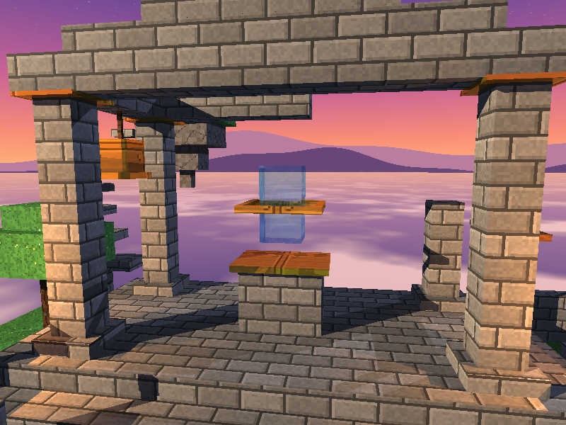 **Altar y cristal:** refracción en el cristal y reflejo en el marco de metal | 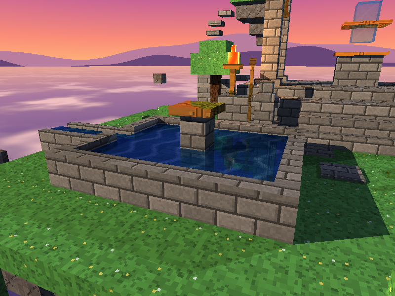 **Estanque:** el agua refracta el fondo y refleja el cielo según el ángulo (Fresnel) |
| 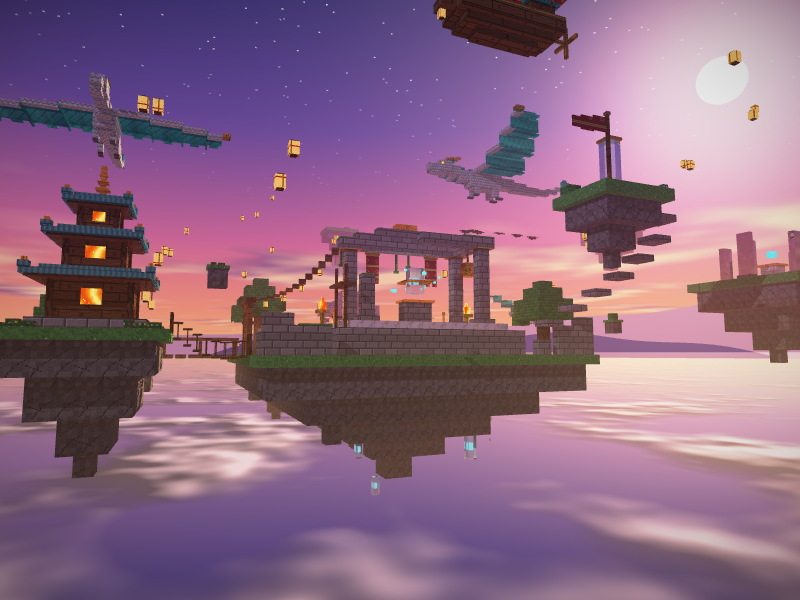 **Contraluz:** el sol del skybox detrás del templo | 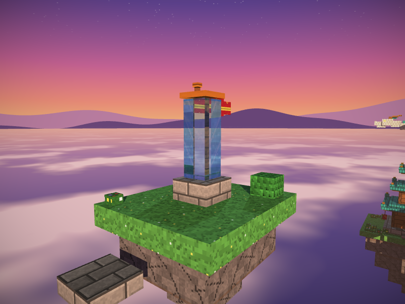 **Obelisco:** cristal alto sobre la isla del santuario |
| 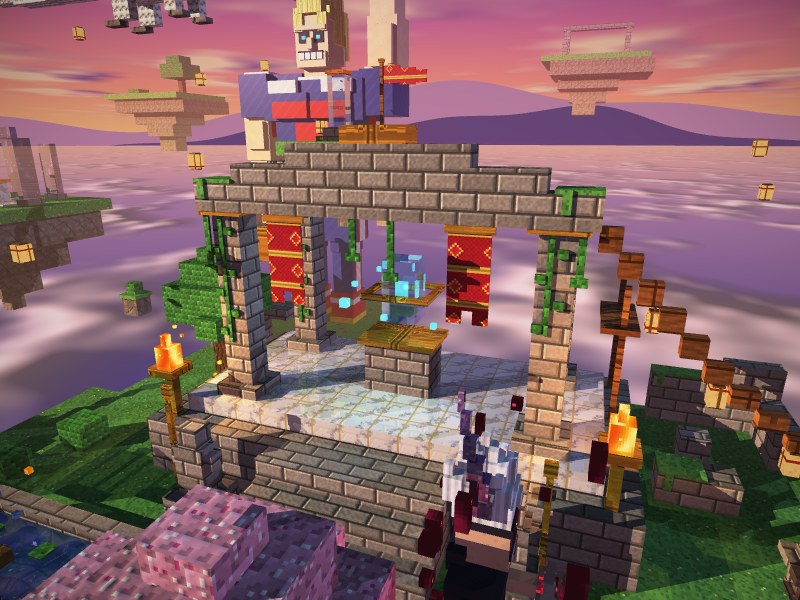 **Braseros:** llamas emisivas con luz puntual cálida | 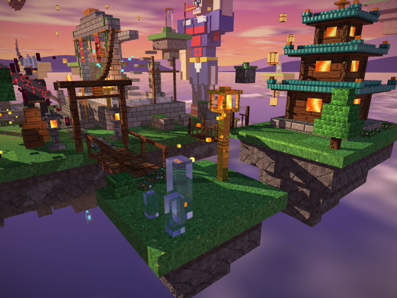 **Farol:** núcleo de fuego que ilumina su isla |
| 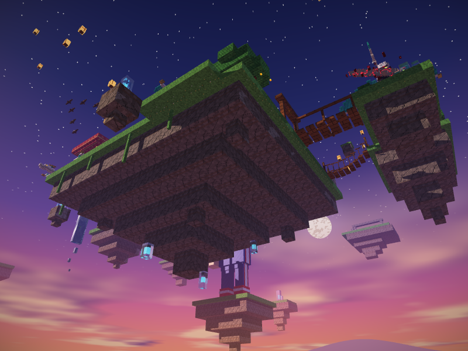 **Desde abajo:** roca natural iluminada por el rebote de las nubes | 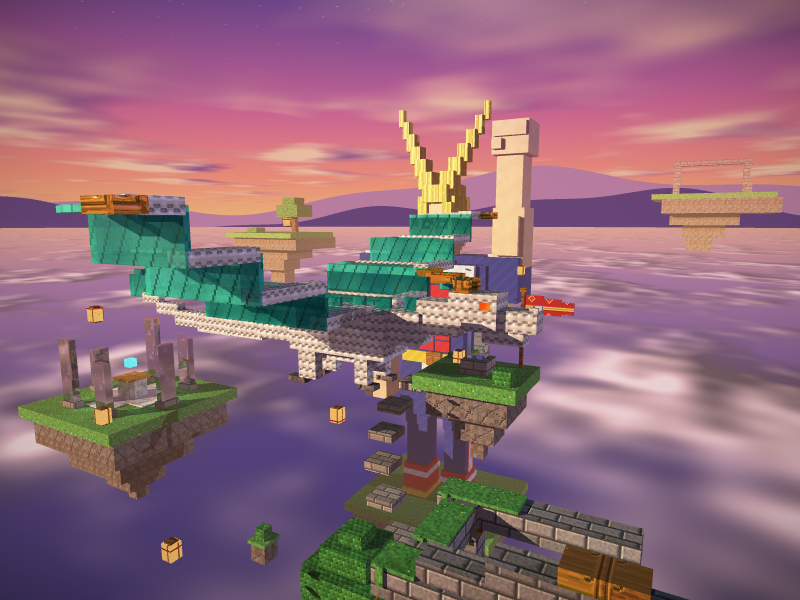 **Dragón:** escamas de marfil, alas de membrana translúcida y ojos de fuego |
| 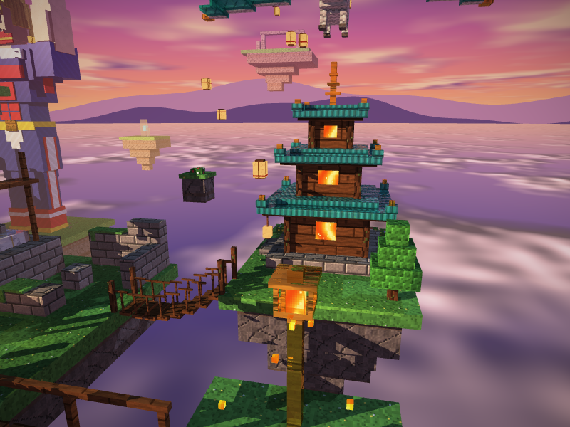 **Pagoda:** tejas vidriadas, ventanas encendidas y puente colgante | 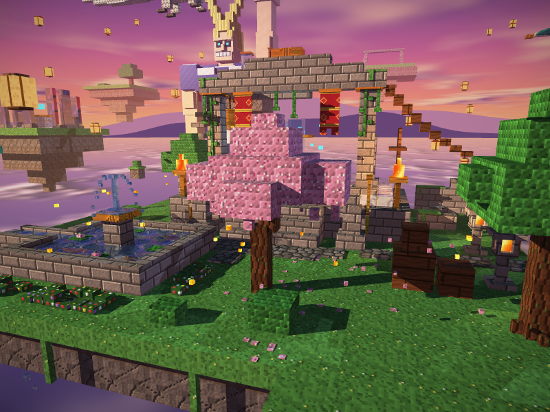 **Cerezo:** copa irregular y pétalos en el suelo y en el aire |
| 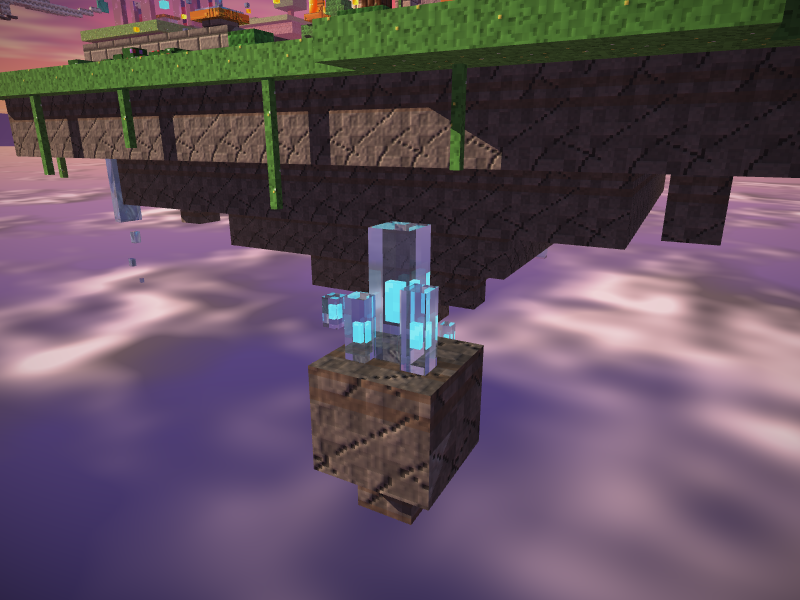 **Islote de cristales:** núcleos mágicos vistos a través del vidrio | 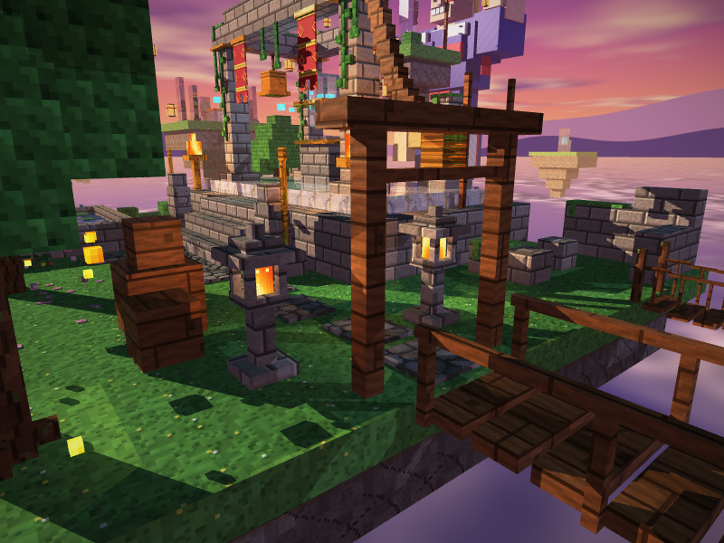 **Linternas de piedra:** luz puntual cálida junto al portal |

## Cómo funciona

Por cada píxel se lanza un rayo desde la cámara (`renderer.rs: render`) y se
busca la caja más cercana que toca (`scene.rs: closest_hit`). En el punto
de impacto, `cast_ray` calcula:

1. **Color propio:** textura × albedo, con luz ambiental **hemisférica**:
   las caras que miran arriba reciben el azul del cielo y las que miran
   abajo, el rebote rosado del mar de nubes.
2. **Luces:** para cada luz, difuso de Lambert (`N·L`) y brillo especular de
   Phong (`(R·V)^shininess`). Hay ocho luces: el sol cálido, un relleno frío
   y seis puntuales (braseros, farol, linternas de piedra y la energía cian
   del altar). Las puntuales se atenúan con `(1 - (d/r)²)²` y no alumbran
   más allá de su alcance `r`.
3. **Sombras:** un rayo hacia cada luz. Si choca con algo antes de llegar,
   pasa solo la fracción que deja pasar ese objeto: nada a través de la
   piedra, casi todo a través del cristal. El origen se desplaza un poco
   (*bias*) para evitar el *shadow acne*.
4. **Reflexión:** un rayo secundario en la dirección `R = I - 2(I·N)N`,
   filtrado por el color de la superficie (por eso el oro refleja dorado).
5. **Refracción:** un rayo que atraviesa el material doblándose según la
   ley de Snell. Si el ángulo no permite salir, hay reflexión interna total.
   La aproximación de Schlick (Fresnel) decide cuánto se refleja y cuánto
   se refracta según el ángulo de vista.
6. **Skybox:** si el rayo no toca nada, el color sale de un cielo
   procedural que solo depende de la dirección del rayo: degradado de
   atardecer, disco del sol, nubes y montañas con ruido fractal propio, y
   estrellas.

Los rebotes son recursivos, con un máximo de 4 (`MAX_DEPTH`).

Detalles extra de calidad:

- **Ondas en el agua:** la normal se inclina con una suma de senos según la
  posición (como un *normal map* calculado), así el reflejo y la refracción
  ondulan.
- **Bruma de distancia:** lo lejano se funde con el color del cielo
  (`1 - e^(-densidad·d)`), lo que da profundidad.
- **Post-proceso** (`postprocess.rs`): *tone mapping* con rodilla suave, que
  comprime las luces muy brillantes en vez de cortarlas en blanco, y una
  viñeta sutil.
- **Antialiasing:** con la cámara quieta, cada píxel promedia 4 rayos en una
  grilla rotada, y los bordes de las cajas quedan suaves.
- **Dragones en coordenadas locales** (`dragon.rs`): el modelo se describe
  con adelante, arriba y lado, y se coloca en cualquiera de las 4
  direcciones y escalas. Así hay tres dragones con distintas poses y
  rumbos, aunque las cajas no se puedan rotar.

## Rendimiento

En un i7-12700H (20 hilos), a 800×600:

| Vista | Tiempo por cuadro |
|---|---|
| General | ~33 ms |
| Altar y cristal | ~81 ms |
| Estanque | ~83 ms |
| Contraluz, obelisco, desde abajo | ~22–25 ms |

Esos tiempos son sin antialiasing, que es como se renderiza mientras la
cámara se mueve. El cuadro quieto con antialiasing tarda unas 4 veces más,
pero se calcula una sola vez.

Optimizaciones, en el orden en que se hicieron (cada una está en su propio
commit, con su medición):

- **Intersect completo solo para la caja ganadora:** primero se busca solo
  la distancia, y la normal y la UV se calculan una vez.
- **Render en paralelo** con `std::thread::scope`. Las filas se reparten
  dinámicamente: cada hilo toma la siguiente libre, así los núcleos rápidos
  del CPU híbrido no esperan a los lentos.
- **Vista previa a media resolución** mientras la cámara se mueve.
- **Corte por importancia:** no se lanza un rebote que aportaría menos del
  6 % al píxel. Por ejemplo, la piedra (2 % de reflejo) ya no paga un rayo
  extra por píxel. Bajó el promedio de 59 a 37 ms.
- **BVH** (`bvh.rs`): árbol de cajas envolventes construido partiendo por
  el eje más largo, que se recorre abriendo primero el hijo más cercano.

## Estructura del código

| Archivo | Contenido |
|---|---|
| `main.rs` | Ventana, controles, vistas predefinidas, modos `--screenshot` y `--bench` |
| `camera.rs` | Cámara orbital con movimiento suavizado |
| `renderer.rs` | `cast_ray` (iluminación, sombras, reflexión, refracción, ondas, bruma) y render en paralelo con antialiasing |
| `postprocess.rs` | Tone mapping y viñeta |
| `dragon.rs` | Modelo de dragón en coordenadas locales |
| `scene.rs` | Construcción del diorama, luces, búsqueda de impactos y sombras |
| `bvh.rs` | Jerarquía de cajas envolventes |
| `cube.rs` | Caja alineada a los ejes: intersección por el método *slab*, normal y UV |
| `material.rs` | Parámetros de cada material |
| `procedural.rs` | Texturas pixel-art y ruido (hash, value noise, ruido fractal) |
| `skybox.rs` | Cielo procedural |
| `texture.rs` | Carga, muestreo y guardado de texturas |
| `light.rs` | Luces lejanas y puntuales con atenuación |
| `color.rs`, `framebuffer.rs`, `ray_intersect.rs` | Tipos básicos |

## Dependencias

Solo las permitidas en el curso:

- [`nalgebra-glm`](https://crates.io/crates/nalgebra-glm) 0.21.0, para vectores.
- [`raylib`](https://crates.io/crates/raylib) 6.0.0 con
  `SUPPORT_IMAGE_GENERATION`, para la ventana, la entrada y las imágenes.

Las texturas, el ruido y el paralelismo están implementados a mano, con la
librería estándar de Rust.
